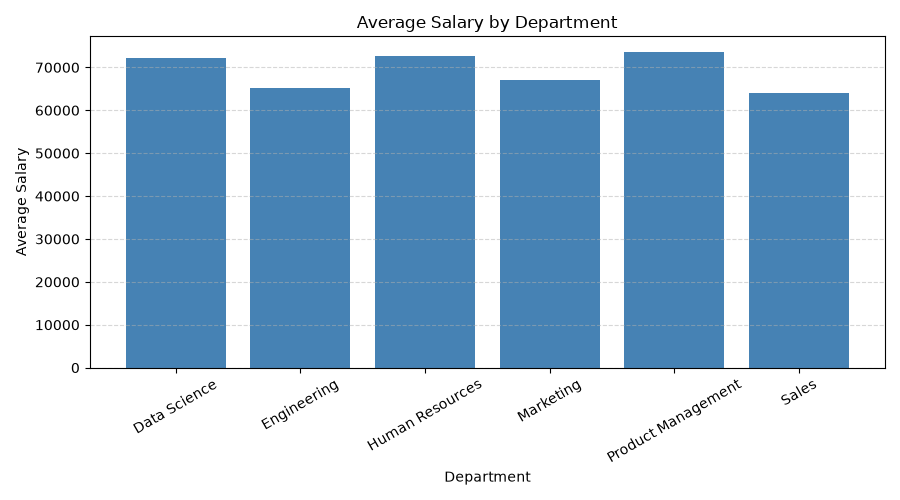
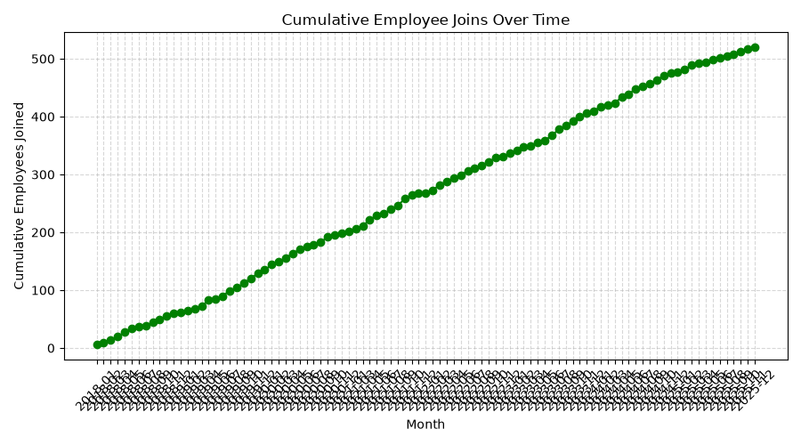
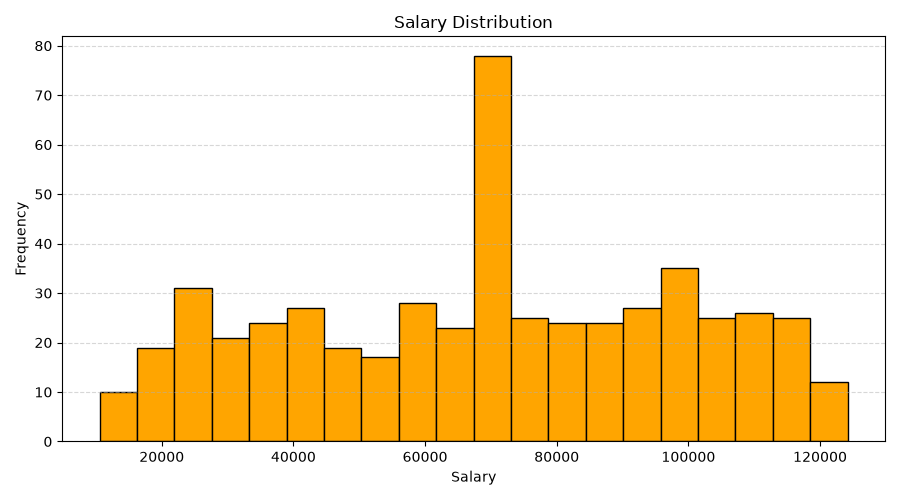
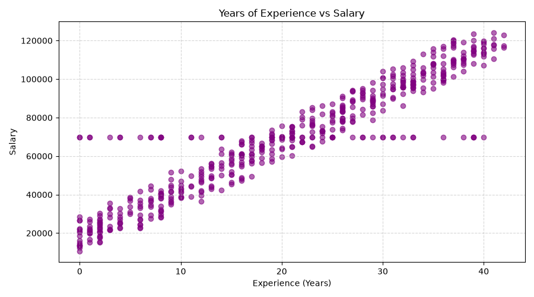
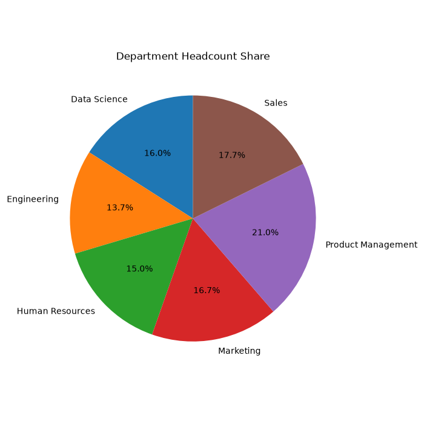

# Employee Data Analysis Report

## Executive Summary
This report summarizes the analysis of the employee dataset.

## Dataset Overview
        department  employee_count   avg_salary  max_salary
      Data Science              83 72288.361446   120365.00
       Engineering              71 65164.326761   123562.67
   Human Resources              78 72751.961538   121101.00
         Marketing              87 67065.849655   119910.67
Product Management             109 73560.577982   124183.00
             Sales              92 63972.228261   118318.00

## Key Findings
1. The highest paying department is Product Management with an average salary of 73560.58.
2. The lowest paying department is Sales with an average salary of 63972.23.
3. The average years of experience across employees is 20.6.
4. 338 out of 520 employees currently have an 'Active' status.
5. There are 6 departments in the dataset.

## Visualizations

## Actionable Recommendations
- Review the pay gap between the highest and lowest paying departments.
- Investigate the source of missing/inconsistent data to prevent it going forward.